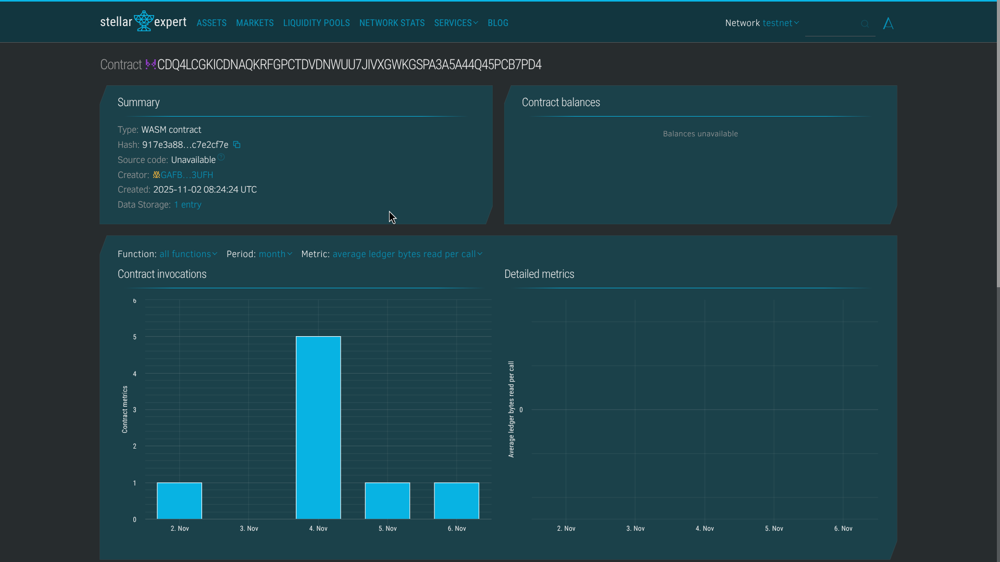

# Stellar Card NFT

A complete NFT card game built on Stellar/Soroban, featuring a Rust smart contract and a React frontend.

## 📋 Overview

Stellar Card NFT is a collectible card game where users can mint, own, and trade NFT cards on the Stellar blockchain. The project consists of:

- **Smart Contract** (Rust/Soroban): NFT contract with minting, transfer, and query functionality
- **Frontend** (React/Vite): Web application for interacting with the contract
- **IPFS Metadata**: Card metadata stored on IPFS

## 🚀 Quick Start

### Prerequisites

- [Stellar CLI](https://developers.stellar.org/docs/tools/stellar-cli) installed
- [Rust](https://www.rust-lang.org/tools/install) (for contract development)
- [Node.js](https://nodejs.org/) 18+ and [pnpm](https://pnpm.io/) (for frontend)
- [Freighter Wallet](https://freighter.app/) browser extension

### Contract Deployment

1. **Build the contract:**

   ```bash
   cd contracts
   stellar contract build
   ```

2. **Deploy to testnet:**

   ```bash
   cd ..
   scripts/deploy_contract.bat
   ```

   Or manually:

   ```bash
   stellar contract deploy \
     --wasm contracts/target/wasm32v1-none/release/stellar_card_contract.wasm \
     --source your_wallet \
     --network testnet
   ```

3. **Initialize the contract:**
   ```bash
   stellar contract invoke \
     --id YOUR_CONTRACT_ID \
     --source your_wallet \
     --network testnet \
     -- initialize \
     --admin YOUR_ADMIN_ADDRESS
   ```

### Frontend Setup

See [frontend/README.md](./frontend/README.md) for detailed frontend setup instructions.

## 📄 Contract Information

### Deployed Contract

- **Contract ID**: `CDQ4LCGKICDNAQKRFGPCTDVDNWUU7JIVXGWKGSPA3A5A44Q45PCB7PD4`
- **Network**: Testnet
- **Stellar Expert**: [View on Stellar Expert](https://stellar.expert/explorer/testnet/contract/CDQ4LCGKICDNAQKRFGPCTDVDNWUU7JIVXGWKGSPA3A5A44Q45PCB7PD4)

### Contract Details

- **Token Standard**: Custom NFT implementation
- **Token IDs**: Zero-based (0, 1, 2, ...)
- **Metadata**: Stored as IPFS URIs
- **Random Minting**: Public mint assigns cards based on token ID modulo 3
  

## 📦 Project Structure

```
StellarCard/
├── contracts/          # Soroban smart contract (Rust)
│   ├── src/
│   │   ├── lib.rs      # Main contract implementation
│   │   └── nft_card.rs # Data structures
│   └── tests/          # Contract tests
├── frontend/           # React frontend application
│   ├── src/
│   │   ├── App.jsx     # Main application component
│   │   └── App.css     # Styles
│   └── package.json
├── packages/           # Shared packages
│   └── stellar_card/   # Contract client package
├── ipfs/              # IPFS metadata files
│   └── metadata/      # Card metadata JSON files
└── scripts/           # Deployment scripts
```

## 🎮 Contract Functions

### Read-Only Functions

- `total_supply()` → `u64`: Get total number of cards minted
- `owner_of(token_id: u64)` → `Address`: Get owner of a specific card
- `token_uri(token_id: u64)` → `String`: Get metadata URI for a card

### State-Changing Functions

- `initialize(admin: Address)`: Initialize the contract (admin only)
- `admin_mint(to: Address, uri: String)` → `u64`: Admin mint a card with specific URI
- `public_mint(to: Address)`: Public mint a random card
- `transfer(from: Address, to: Address, token_id: u64)`: Transfer a card

## 🛠️ Development

### Build Contract

```bash
cd contracts
stellar contract build
```

### Test Contract

```bash
cd contracts
cargo test
```

### Run Frontend

```bash
cd frontend
pnpm install
pnpm dev
```

### Build Frontend

```bash
cd frontend
pnpm build
```

## 📝 Scripts

- `scripts/deploy_contract.bat`: Deploy contract to testnet
- `scripts/mint_sample_cards.bat`: Mint sample cards (Fire Dragon, Ice Mage, Stone Warrior)
- `scripts/test_contracts.bat`: Run contract tests

## 🌐 IPFS Metadata

Card metadata is stored on IPFS. Sample cards include:

- **Fire Dragon**: Epic rarity, 90 Attack, 75 Defense
- **Ice Mage**: Rare rarity, 70 Attack, 85 Defense
- **Stone Warrior**: Common rarity, 60 Attack, 90 Defense

Metadata format:

```json
{
  "name": "Card Name",
  "description": "Card description",
  "image": "ipfs://...",
  "attributes": [
    {
      "trait_type": "Rarity",
      "value": "Epic"
    },
    {
      "trait_type": "Attack",
      "value": "90"
    }
  ]
}
```

## 🚢 Deployment

### Frontend Deployment (Vercel)

1. Set environment variable `VITE_CONTRACT_ID` in Vercel dashboard
2. Deploy from root directory:
   ```bash
   vercel --prod
   ```

See [frontend/README.md](./frontend/README.md) for more details.

## 📚 Resources

- [Stellar Documentation](https://developers.stellar.org/)
- [Soroban Documentation](https://soroban.stellar.org/docs)
- [Freighter Wallet](https://freighter.app/)
- [Stellar Expert](https://stellar.expert/)

## 📄 License

ISC

## 👤 Author

Your Name
